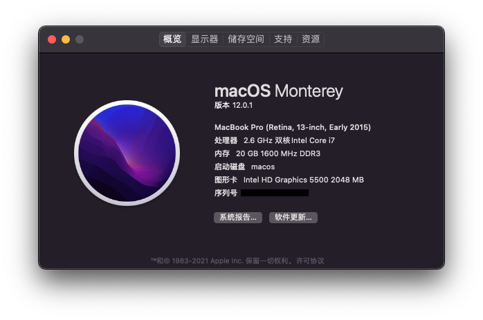

# ThinkPad T450s Big Sur OpenCore 0.6.6

## 简介
- 这是一个完整的ThinkPad T450s macOS Big Sur + DW1820a 配置。
- 声卡默认 layout-id = 32，耳机杂音请使用声卡修复脚本(ALCPlugFix)。 
- 如果你想使用扩展坞上的音频接口，请将声卡 layout-id 设置为 55 ，选择线路输出。
- 支持触摸屏（带有多点触控和触屏手势）。
- 支持 Catalina。
- 支持 ThinkPad X250 ThinkPad T450。
- 一键开启Hi-DPI  参考:（https://github.com/xzhih/one-key-hidpi）。
## 硬件信息

```  
- CPU：Intel Core i7-5600U 2.6GHz (Boots 3.2GHz)

- 核心显卡：Intel HD 5500 Graphics 

- 声卡：ALC292

- 无线网卡：DW1820A   
```

# ThinkPad助手(ThinkpadAssistant)
- 可让您在Thinkpad T450s X250 T450笔记本电脑上使用所有功能键。
- 复制ThinkpadAssistant到应用程序文件夹。
- 启动ThinkpadAssistant，并在菜单栏中勾选“登录时启动”。
- F4：麦克风静音/取消静音（带有状态LED指示）。
- F7：屏幕镜像/屏幕扩展。
- F8：启用/停用Wi-Fi。
- 左Shift + F8键：启用/停用蓝牙。
- F9：打开系统偏好设置。
- F12：打开启动板。
- FN + Space：切换键盘背光。
- FN + 4：睡眠快捷键。
（睡眠过程中再次按下睡眠快捷键即可终止睡眠。）
（连接外部显示器时，按睡眠按钮后，工作屏幕变为外部显示器（内部屏幕关闭）；再按一次睡眠按钮，内部和外部显示器恢复正常。）
- PrtSc 映射到 F13：可在系统偏好设置-->键盘-->快捷键将它设置为截图。
-------------------------------------------------------------------------------------------------------------


## BIOS (1.37)
-  Security -> Security Chip`: **Disabled**;
-  Memory Protection -> Execution Prevention`: **Enabled**;
-  Virtualization -> Intel Virtualization Technology`: **Enabled**;
-  Internal Device Access -> Bottom Cover Tamper Detection`: must be **Disabled**;
-  Anti-Theft -> Current Setting`: **Disabled**;
-  Anti-Theft -> Computrace -> Current Setting`: **Disabled**;
-  Secure Boot -> Secure Boot`: **Disabled**;
-  UEFI/Legacy Boot`: **UEFI Only**;
-  CSM Support`: **Yes**.

## 有效
- CPU
- 睡眠/唤醒
- Wifi
- 蓝牙 
- Handoff, Continuity, AirDrop
- iMessage, FaceTime, App Store, iTunes Store
- 以太网卡  （连接扩展坞后无法使用笔记本上的以太网接口）
- 声卡
- USB
- 电池
- 触摸屏 
- 触摸板 
- 小红点
- miniDP
- SD卡读卡器
- 扩展坞 USB
- 扩展坞 以太网
- 扩展坞 音频 （需要将声卡 layout-id 设置为 55 ）

## 无效
- VGA
- 指纹
- 扩展坞 DisplayPort
- 扩展坞 VGA
- 扩展坞 DVI
- 扩展坞 HDMI
