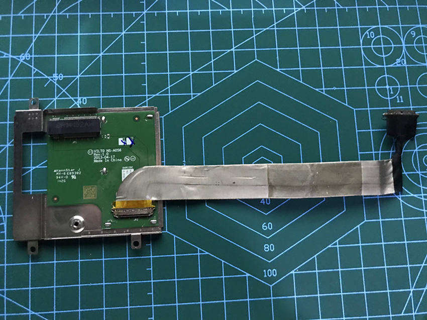
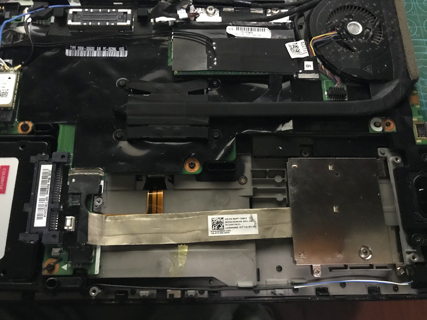
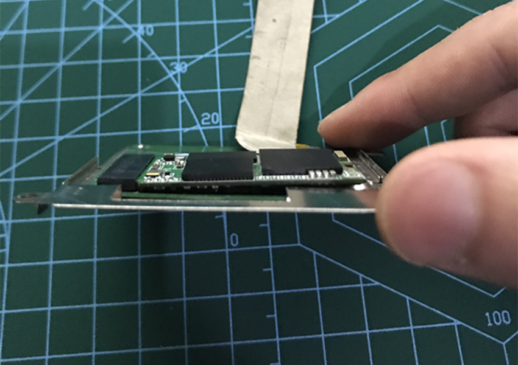

# Customized OpenCore 0.8.0 EFI for ThinkPad T450s T450 X1C3 
Modified to work better with Mac OS Monterey. 

What works: Everything besides VGA. Touchscreen support on 3rd gen X1 Carbon. SD-card slot also works without any issue.

What’s been changed:

1. Default language changed from Chinese to English, mainly noticeable when performing fresh install.
2. Intel WIFI works as it should, Location Services works. Added multiple AirportItlwm.kext drivers for: Catalina, Big Sur, and Monterey (Monterey AirportItlwm.kext is enabled by default). Can be found at: Kernel > Add > 16 + 17 + 18 . Alternatively use itlwm.kext instead by enabling 19 (and disabling all other AirportItlwm.kext that comes before it.
3. Under NVRAM > Delete > 7C436110-AB2A-4BBB-A880-FE41995C9F82, prev-lang:kbd was added to make sure that English Language is detected and selected by default.
4. ThinkPad Assistant not included. All of the function keys for T450/s and X1 Carbon work perfectly as it is, and I wanted to reduce clutter. Other files such as Lenovo Wallpapers and DW1820a driver are also not included.
5. Added support for Android USB tethering, so that you can now tether your cellphone to the hackintosh (with USB), and enjoy faster speeds. The HoRNDIS driver that was added is supported by Catalina, Big Sur, Monterey, and most likely older Mac OS. This kext does not interfere with any of the other kexts, and works perfectly.
6. Added service manuals for all compatible Thinkpad laptops.

This EFI has only been tested with Monterey and Catalina, but should work fine with Big Sur. 

If you have any questions, you can get in touch with me at: Mark@OTGRepairs.net, or on Messages at: otgr340@yahoo.com

Good Luck!

-Mark

(Original documentation below)

# ThinkPad T450s X250 T450 X1C3 Monterey OpenCore 0.8.0


[](https://developer.apple.com/documentation/macos-release-notes)
[](https://github.com/acidanthera/OpenCorePkg)
[](https://think.lenovo.com.cn/index.html)

**DISCLAIMER:**

### The author：[@CLAY-BIOS](https://github.com/CLAY-BIOS)  
Before you begin, read the entire readme file.
I don't accept any responsibility for any damage that may be caused.
If you find errors or have any improvements (whether in the configuration or in the document), consider opening an issue or a pull request.
If you find my work useful, consider clicking ⭐️Star in the upper right corner.
It would mean a lot to me.


## Introduction

- This repository was originally created for ThinkPad T450s. The default network card is DW1820A, and some other models have been supported through subsequent updates.
- Sound card default Layout-id = 32, if you hear noise upon connecting headphones, use the sound card repair script (ALCPlugFix), found in this repository.
- If you want to use the audio interface on the Docking, set the layout-id of the sound card to 55 and select the line output.
- Touchscreen support (With multi-touch and touchscreen gestures).
- Monterey support.
- Big Sur support.
- Catalina support.
- Mojave support.
- Docking support.
- Sidecar support (Turning on sidecar will cause the system to freeze randomly, Sidecar is disabled by default).
- This EFI (and other applications) works for all ThinkPads using 5th generation CPUs (Broadwell). Confirmed supported models are shown below.
- support ThinkPad X250, T450, T450s, X1 Carbon 3rd.
- Note: The 4th generation CPU (Haswell) is not supported. ThinkPad has never officially launched the 4th generation CPU (Haswell) T450, T450s, X250, X1C3, which are essentially T440, T440s, X240, X1C2.

## Hardware information
```  
- CPU：Intel Core i7-5600U i7-5600U i7-5500u i5-5300U i5-5200U

- Integrated grapics：Intel HD 5500 Graphics 

- Sound card：ALC292

- Wireless network card：DW1820A Intel7265AC IntelAX200 BCM943224 BCM94360Z3 BCM94360Z4 BCM94360CD BCM94360CS2

- Note ⚠️： For ThinkPad x250, t450 and t450s, only BCM94360CD of Apple network card can be driven normally in win10, and other apple network cards cannot search any signal in win10.
```
## Installation

<details>  
<summary><strong>macOS installation</strong></summary>
</br>

1. [Create an installation media](https://dortania.github.io/OpenCore-Install-Guide/installer-guide/#making-the-installer)
1. Download the [latest EFI folder](https://github.com/CLAY-BIOS/Lenovo-ThinkPad-T450s-Hackintosh-Big-Sur-OpenCore/releases) and copy it into the ESP partiton
1. Change your BIOS settings according to the table below
1. Boot from the USB installer (press `F12` to choose boot volume) and [start the installation process](https://dortania.github.io/OpenCore-Install-Guide/installation/installation-process.html#booting-the-opencore-usb)
1. If your internal hard drive doesn't show up during installation, go back to the main screen (by cancelling the installation), open the Disk Utility and format it as APFS.

</details>

<details>  
<summary><strong>BIOS Setup (do this before installing macOS)</strong></summary>
</br>

**BIOS (1.37):**
-  Security -> Security Chip`: **Disabled**;
-  Memory Protection -> Execution Prevention`: **Enabled**;
-  Virtualization -> Intel Virtualization Technology`: **Enabled**;
-  Internal Device Access -> Bottom Cover Tamper Detection`: must be **Disabled**;
-  Anti-Theft -> Current Setting`: **Disabled**;
-  Anti-Theft -> Computrace -> Current Setting`: **Disabled**;
-  Secure Boot -> Secure Boot`: **Disabled**;
-  UEFI/Legacy Boot`: **UEFI Only**;
-  CSM Support`: **Yes**.

</details>

## state
<details>  
<summary><strong>What works ✅</strong></summary>
</br>
 
- [x] CPU Power management
- [x] Intel HD 5500 Graphics 
- [x] USB
- [x] Camera
- [x] Sleep/wake up/shut down/restart
- [x] Intel Gigabit Ethernet (you can't use the Ethernet interface on your laptop after connecting to the docking station)
- [x] Wifi, Bluetooth, Airdrop, Handoff, Continuity     (Using intel-Wi-Fi may cause no sound after waking up)
- [x] iMessage, FaceTime, App Store, iTunes Store
- [x] Speaker and headphone jack    
- [x] Battery and complete battery information
- [x] Keyboard maps and hotkeys with [ThinkpadAssistant](https://github.com/MSzturc/ThinkpadAssistant) 
- [x] Trackpad, TrackPoint, and the physical button 
- [x] Touchscreen      (With multi-touch and touchscreen gestures)
- [x] Mini DisplayPort
- [x] SD card reader    
- [x] Docking USB
- [x] Docking Ethernet
- [x] Docking Audio     ( Set layout-id of sound card to 55. )
- [x] Docking VGA
- [x] Docking DisplayPort
- [x] Docking DVI
- [x] Docking HDMI
- [x] Sidecar (Sidecar may cause system instability. Sidecar is disabled by default.)

</details>

<details>  
<summary><strong>What doesn't work ❌</strong></summary>
</br>

- [ ] VGA
- [ ] The fingerprint

</details>

<details>  
<summary><strong>Known issues ⚠️</strong></summary>
</br>

1. An external 4K monitor needs to unlock the advanced BIOS options to modify the DVMT, but this is difficult to implement and requires a simple method.
2. Due to DVMT limitation, the maximum resolution is only 2K-60hz. If your screen resolution exceeds 2K-60hz, the screen will be black.
3. When you sleep with Wi-Fi turned off, Wi-Fi cannot be turned on, and you need to sleep again to turn it on.
4. The docking graphics interface has no audio output.
5. Turning on sidecar will cause the system to freeze randomly.
6. the ThinkPad X1 carbon 3rd docking station cannot use the Ethernet interface because there is no corresponding driver support in the MacOS.
7. In MacOS Monterey, the Airdrop can only receive but not send.
8. There are some problems with Bluetooth in MacOS Monterey, and there is no solution at present.

</details>

<details>  
<summary><strong>About Bluetooth</strong></summary>
</br>

- 1.Because Apple modified the Bluetooth stack in MacOS Monterey, Bluetooth cannot be used normally in MacOS Monterey.
- 2.In MacOS Monterey, use brcmbluetoothinjector.kext + BlueToolFixup.Kext to drive brcm Bluetooth.
- 3.In MacOS Monterey, use IntelBluetoothfirmware.kext + BlueToolFixup. Kext to drive Intel Bluetooth.
- 4.Even if Bluetooth is driven in MacOS Monterey, only some functions can be used.
- 5.reference resources:https://github.com/acidanthera/bugtracker/issues/1821

</details>

<details>  
<summary><strong>Intel Wi-Fi</strong></summary>
</br>

### instructions：
- Select this option in the config file according to your system version, default is Monterey.

</details>

<details>  
<summary><strong>Docking</strong></summary>
</br>

- Note⚠️: the ThinkPad X1 carbon 3rd docking(DU9026S1) station cannot use the Ethernet interface because there is no corresponding driver support in the MacOS.
- ThinkPad X250 ThinkPad T450 ThinkPad T450s docking(40A1、40A2) station can be used normally.
- Use of docking can cause sleep problems, the solution is to add SSDT-IGBE patch to config.plist->ACPI.
- Flap mode cannot be used with SSDT-IGBE patch.
- Up to three displays (including the built-in display) 


</details>

<details>  
<summary><strong>ThinkPad Assistant</strong></summary>
</br>

- Allows you to use all function keys on Thinkpad T450s X250 T450 laptop.
- Copy the ThinkpadAssistant into the Application folder.
- Start ThinkpadAssistant and check "Start when logged in" in the menu bar.
- F4: Mute / Unmute Microphone (with Status LED indication).
- F7: Screen mirroring / Screen extending.
- F8: Activate / Deactivate Wi-Fi.
- Left Shift+F8: Activate / Deactivate Bluetooth.
- F9: Open System Preferences.
- F12: Open Launchpad.
- FN+Space: Toggle Keyboard Backlight.
- PrtSc maps to F13: this can be set as screenshot in system preferences -> keyboard -> shortcut.

</details>

<details>  
<summary><strong>Sleep shortcut</strong></summary>
</br>

- FN + 4: Sleep shortcut key. (During sleep, press the sleep shortcut again to terminate sleep. This method is implemented by ACPI patch, and the function is the same as in Windows.)
- When using the power adapter to supply power, if you connect an external monitor. FN + 4 becomes (off/on) the built-in display.
(After pressing the sleep shortcut key, the display screen changes to the external monitor (the internal screen is turned off); press the sleep shortcut key again (the internal display turns on again).


</details>

<details>  
<summary><strong>Fan and LED controls (recommended; prevents overheating)</strong></summary>
</br>

1. Download and install [YogaSMC-App-Release.dmg](https://github.com/zhen-zen/YogaSMC/releases) 
1. Install and open the application
1. Choose "Auto" from the menubar icon
1. Check the "Start at Login" option

</details>

<details>  
<summary><strong>One key Hi-DPI</strong></summary>
</br>

1. reference: https://github.com/xzhih/one-key-hidpi

</details>

</details>

<details>  
<summary><strong>Sidecar</strong></summary>
</br>


</details>

## Third hard disk 
<details>  
<summary><strong>How to install the third hard drive  </strong></summary>
</br>

1. ThinkPad X250 ThinkPad T450 ThinkPad T450s Can expand the third hard drive.
1. Purchase the third hard drive expansion board (pictured), which only supports single-sided M.2 2242 SATA SSD. 

1. Insert M.2 2242 SATA SSD。

1. Install it under the battery. 


</details>

<details>  
<summary><strong>How to install double-sided  M.2 2242 SATA SSD </strong></summary>
</br>


1. Insert the double-sided M.2 2242 SATA SSD into the expansion board. 

1. Then gently press down on the SSD and gently lift the expansion board. (This requires a little patience) .


1. Screw on the screws. 

</details>

# Credits

- [@Sniki](https://github.com/Sniki?tab=repositories) 
- [@benbender](https://github.com/benbender/x1c6-hackintosh/blob/experimental/EFI/OC/dsl/SSDT-BATX.dsl) A new generation of battery patches.
- [@zhen-zen](https://github.com/zhen-zen) for YogaSMC.
- [daliansky](https://github.com/daliansky/OC-little) for various ACPI hotpatch samples.  
- [@xzhih](https://github.com/xzhih) for one-key-hidpi.  
- [@cholonam](https://github.com/cholonam/Sinetek-rtsx) [Card reader fix](https://github.com/cholonam/Sinetek-rtsx/pull/18)
- [@MSzturc](https://github.com/MSzturc/ThinkpadAssistant) for ThinkpadAssistant.
- [@zxystd](https://github.com/OpenIntelWireless/itlwm) Intel Wi-Fi Drivers for macOS.
- [@0xFireWolf](https://github.com/0xFireWolf/RealtekCardReader) Card reader driver。

The greatest thank you and appreciation to the [Acidanthera](https://github.com/acidanthera) team.

Questions are welcome, but please don't ask too low - level questions.
