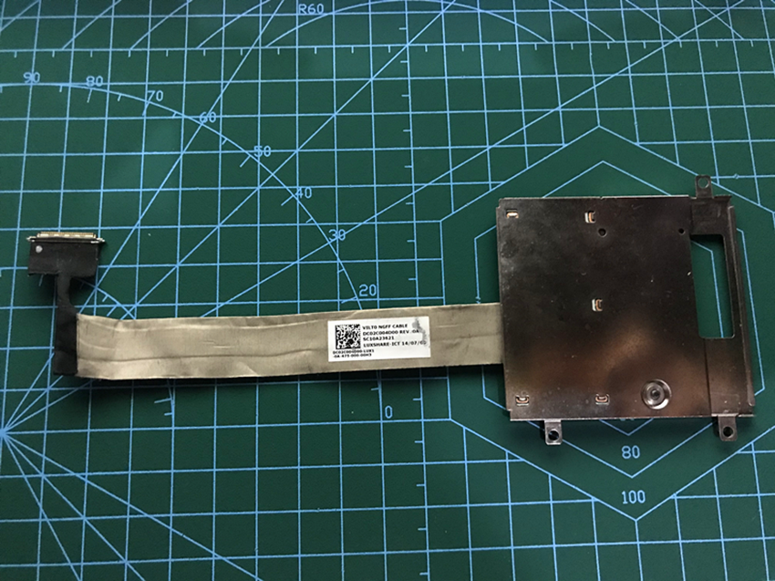
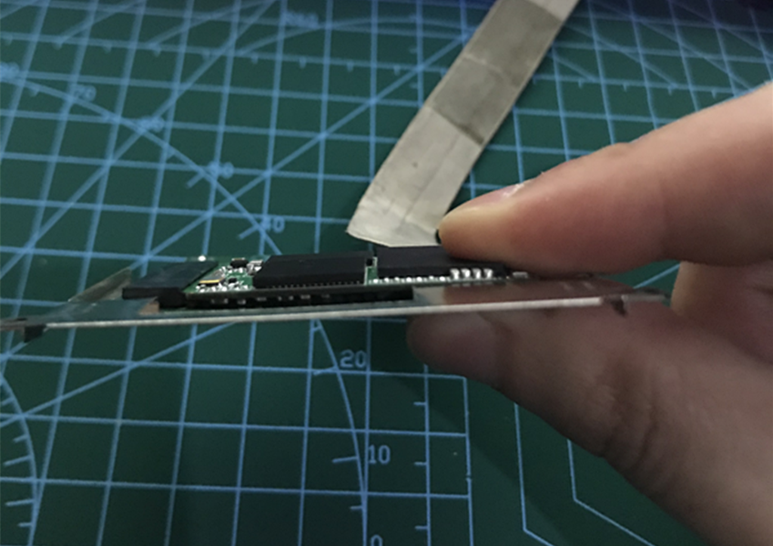
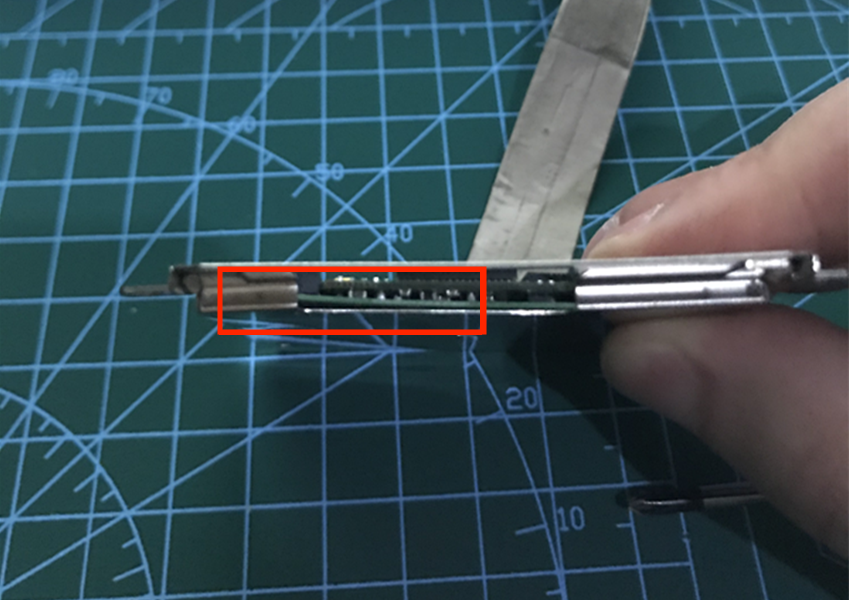

# ThinkPad T450s X250 T450 X1C3 Monterey OpenCore 0.7.9


[](https://developer.apple.com/documentation/macos-release-notes)
[](https://github.com/acidanthera/OpenCorePkg)
[](https://think.lenovo.com.cn/index.html)

**免责声明:**

### 作者：[@CLAY-BIOS](https://github.com/CLAY-BIOS)  
在开始之前，请阅读整个自述文件。
我对可能造成的任何损失不承担任何责任。
如果您发现错误或有任何改进（无论是在配置中还是在文档中），请考虑打开问题或拉取请求。
如果您发现我的工作有用，可以考虑点击右上角的⭐️Star。
这对我来说意义重大。 


## 简介

- 此仓库原本是为ThinkPad T450s创建，默认网卡为DW1820a，通过后续更新支持了一些其他机型。
- 声卡默认 layout-id = 32，耳机杂音请使用声卡修复脚本(ALCPlugFix)。 
- 如果你想使用扩展坞上的音频接口，请将声卡 layout-id 设置为 55 ，选择线路输出。
- 支持触摸屏（带有多点触控和触屏手势）。
- 支持 Monterey。
- 支持 Big Sur。
- 支持 Catalina。
- 支持 Mojave。
- 支持扩展坞。
- 支持 Sidecar (开启Sidecar会导致系统随机冻结，默认为关闭状态)。
- 此仓库可适用于所有使用第五代CPU（Broadwell）的ThinkPad，已经确认支持的型号如下：
- 支持 ThinkPad X250 ThinkPad T450 ThinkPad T450s ThinkPad X1 Carbon 3rd。
- 注意：4代CPU(Haswell)不在支持的范围内，ThinkPad官方从未推出过4代CPU(Haswell)的T450、T450s、X250、X1C3，其本质上是T440、T440s、X240、X1C2。

## 硬件信息
```  
- CPU：Intel Core i7-5600U i7-5500u i5-5300U i5-5200U

- 核心显卡：Intel HD 5500 Graphics 

- 声卡：ALC292

- 无线网卡：DW1820A  Intel7265AC IntelAX200  BCM943224  BCM94360Z3  BCM94360Z4 
```
## 安装和BIOS设置

<details>  
<summary><strong>如何安装macOS </strong></summary>
</br>

1. [创建安装媒体](https://dortania.github.io/OpenCore-Install-Guide/installer-guide/#making-the-installer)
1. 下载[最新的EFI文件](https://github.com/CLAY-BIOS/Lenovo-ThinkPad-T450s-Hackintosh-Big-Sur-OpenCore/releases) 并将其复制到ESP分区中
1. 从USB启动安装程序（按“ F12”选择启动盘），然后[开始安装过程](https://dortania.github.io/OpenCore-Install-Guide/installation/installation-process.html#booting-the-opencore-usb)

</details>

<details>  
<summary><strong>BIOS设置 </strong></summary>
</br>

**BIOS (1.37):**
-  Security -> Security Chip`: **Disabled**;
-  Memory Protection -> Execution Prevention`: **Enabled**;
-  Virtualization -> Intel Virtualization Technology`: **Enabled**;
-  Internal Device Access -> Bottom Cover Tamper Detection`: must be **Disabled**;
-  Anti-Theft -> Current Setting`: **Disabled**;
-  Anti-Theft -> Computrace -> Current Setting`: **Disabled**;
-  Secure Boot -> Secure Boot`: **Disabled**;
-  UEFI/Legacy Boot`: **UEFI Only**;
-  CSM Support`: **Yes**.

</details>

## 状态
<details>  
<summary><strong>什么有效 ✅</strong></summary>
</br>
 
- [x] CPU电源管理
- [x] Intel HD 5500 Graphics 
- [x] 完整的USB
- [x] 摄像头
- [x] 休眠/唤醒/关机/重启
- [x] 英特尔千兆以太网  （连接扩展坞后无法使用笔记本上的以太网接口）
- [x] Wi-Fi，蓝牙，空投投送，切换，连续性  （使用intel-Wi-Fi将导致某些功能不可用）
- [x] iMessage, FaceTime, App Store, iTunes Store
- [x] 扬声器和耳机插孔   
- [x] 电池和完整的电池信息  
- [x] 键盘地图和热键 [ThinkpadAssistant](https://github.com/MSzturc/ThinkpadAssistant) 
- [x] 触控板、小红点和物理按钮      
- [x] 触摸屏 （带有多点触控和触屏手势）
- [x] mini DisplayPort
- [x] SD卡读卡器
- [x] 扩展坞 USB
- [x] 扩展坞 以太网
- [x] 扩展坞 耳机插孔 （需要将声卡 layout-id 设置为 55 ）
- [x] 扩展坞 VGA
- [x] 扩展坞 DisplayPort
- [x] 扩展坞 DVI
- [x] 扩展坞 HDMI
- [x] Sidecar (开启Sidecar可能导致系统不稳定，默认为关闭状态)。

</details>

<details>  
<summary><strong>什么不起作用 ❌</strong></summary>
</br>

- [ ] VGA
- [ ] 指纹

</details>

<details>  
<summary><strong>已知问题⚠️</strong></summary>
</br>

- 1.外接4K显示器需要解锁BIOS高级选项修改DVMT，但这实施起来难度较高，需要有一个简单的方法。
- 2.因为DVMT限制，最大分辨率只有2K-60hz，如果你的屏幕分辨率超过了2K-60hz，那么将会黑屏。
- 3.在关闭WI-FI的情况下进行睡眠，Wi-Fi无法打开，需要再进行一次睡眠才可以打开。
- 4.扩展坞图形接口没有音频输出。
- 5.开启Sidecar会导致系统随机冻结。
- 6.ThinkPad X1 Carbon 3rd 的扩展坞无法使用以太网接口，因为macOS中没用对应的驱动程序支持。
- 7.在macOS Monterey中隔空投送只能接收不能发送。
- 8.在macOS Monterey中蓝牙存在一些问题，目前还没有解决方法。

</details>

<details>  
<summary><strong>关于蓝牙</strong></summary>
</br>

- 1.因为Apple修改了macOS Monterey 中蓝牙堆栈，导致在macOS Monterey中蓝牙无法正常使用。
- 2.在macOS Monterey中请使用 BrcmBluetoothInjector.kext + BlueToolFixup.kext 来驱动Brcm蓝牙。
- 3.在macOS Monterey中请使用 IntelBluetoothFirmware.kext + BlueToolFixup.kext 来驱动Intel蓝牙。
- 4.即使在macOS Monterey中驱动了蓝牙也只能使用部分功能。
- 5.参考：https://github.com/acidanthera/bugtracker/issues/1821

</details>

<details>  
<summary><strong>关于Intel Wi-Fi</strong></summary>
</br>

### 说明：
- 在config文件中根据自己的系统版本勾选，默认为Monterey。


</details>

<details>  
<summary><strong>关于扩展坞</strong></summary>
</br>

_ 注意⚠️：ThinkPad X1 Carbon 3rd 的扩展坞（DU9026S1）无法使用以太网接口，因为macOS中没用对应的驱动程序支持。
- ThinkPad X250 ThinkPad T450 ThinkPad T450s的扩展坞（40A1、40A2）可以正常使用。
- 使用扩展坞会导致睡眠出现问题，解决方法是在 config.plist->ACPI 中勾选 SSDT-IGBE 补丁。
- 使用 SSDT-IGBE 补丁无法使用翻盖模式。
- 最多可同时连接三台显示器（包括内置显示器）。


</details>

<details>  
<summary><strong>ThinkPad助手(ThinkpadAssistant)</strong></summary>
</br>

- 可让你在Thinkpad T450s X250 T450 笔记本电脑上使用所有功能键。
- 复制ThinkpadAssistant到应用程序文件夹。
- 启动ThinkpadAssistant，并在菜单栏中勾选“登录时启动”。
- F4：麦克风静音/取消静音（带有状态LED指示）。
- F7：屏幕镜像/屏幕扩展。
- F8：启用/停用Wi-Fi。
- 左Shift + F8键：启用/停用蓝牙。
- F9：打开系统偏好设置。
- F12：打开启动板。
- FN + Space：切换键盘背光。
- PrtSc 映射到 F13：可在系统偏好设置-->键盘-->快捷键将它设置为截图。

</details>

<details>  
<summary><strong>睡眠快捷键</strong></summary>
</br>

- FN + 4：睡眠快捷键。（睡眠过程中再次按下睡眠快捷键即可终止睡眠。此方法通过ACPI补丁实现，功能与Windows中一样。）
- 在使用电源适配器供电时，如果你连接了接外部显示器 。FN + 4 变为（关闭/打开）内置显示器。
（按睡眠快捷键后，显示屏幕变为外部显示器（内部屏幕关闭）；再按一次睡眠快捷键（内部显示器重新打开）。

</details>

<details>  
<summary><strong>启用风扇和LED控制</strong></summary>
</br>

1. 下载并安装 [YogaSMC-App-Release.dmg](https://github.com/zhen-zen/YogaSMC/releases) 
1. 打开应用程序
1. 勾选“登录后启动”选项

</details>

<details>  
<summary><strong>一键开启Hi-DPI</strong></summary>
</br>

1. 参考:   https://github.com/xzhih/one-key-hidpi

</details>

<details>  
<summary><strong>Sidecar</strong></summary>
</br>


</details>

## 第三硬盘位
<details>  
<summary><strong>如何安装第三硬盘 </strong></summary>
</br>

1. ThinkPad X250 ThinkPad T450 ThinkPad T450s 可以扩展第三硬盘。
1. 购买第三硬盘扩展板（如图），它仅支持单面 M.2 2242 SATA SSD。

1. 插入单面 M.2 2242 SATA SSD。

1. 将它安装在电池下方。


</details>

<details>  
<summary><strong>如何安装双面 M.2 2242 SATA SSD </strong></summary>
</br>

1. 将双面 M.2 2242 SATA SSD插入扩展板。

1. 然后轻轻将SSD按下，轻轻翘起扩展板。（这需要一点耐心）


1. 拧上螺丝。

</details>


> # 学分

- [@Sniki](https://github.com/Sniki?tab=repositories)
- [@benbender](https://github.com/benbender/x1c6-hackintosh/blob/experimental/EFI/OC/dsl/SSDT-BATX.dsl) 新一代电池补丁。
- [@zhen-zen](https://github.com/zhen-zen) for YogaSMC。
- [@daliansky](https://github.com/daliansky/OC-little) 各种ACPI热补丁样本。 
- [@xzhih](https://github.com/xzhih) 一键开启Hi-DPI。 
- [@cholonam](https://github.com/cholonam/Sinetek-rtsx) [读卡器修复](https://github.com/cholonam/Sinetek-rtsx/pull/18)
- [@MSzturc](https://github.com/MSzturc/ThinkpadAssistant) ThinkPad助手。
- [@zxystd](https://github.com/OpenIntelWireless/itlwm) Intel Wi-Fi Drivers for macOS。
- [@0xFireWolf](https://github.com/0xFireWolf/RealtekCardReader) 读卡器驱动。

非常感谢 [Acidanthera](https://github.com/acidanthera) 团队，如果没有他们的工作，这将是不可能的。

欢迎提问，但请不要问太低级的问题。
